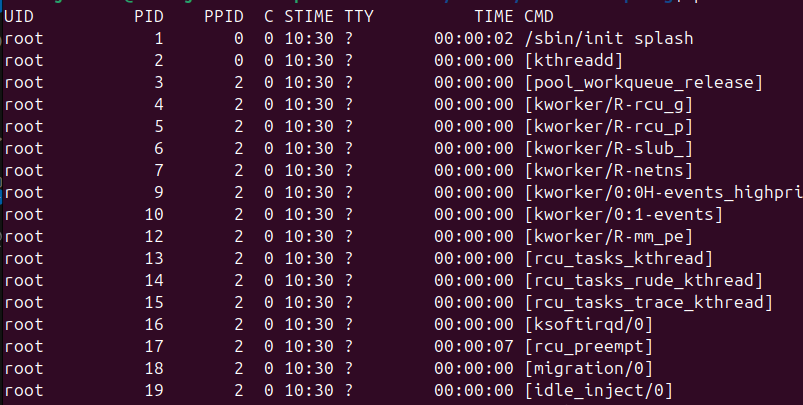

# Terminal Linux e Shell Scripting

Documentação para manipulação no terminal Linux através de shell scripting

## Sumário
* [Tabela de Comandos](#tabela-de-comandos) 
* [Manipulação de arquivos e pastas](#manipulação-de-arquivos-e-pastas)
* [Editores de Texto](#editores-de-texto)
* [Processamento de Texto](#processamento-de-texto)
* [Streams, pipes e redirecionamentos](#sterams-pipes-e-redirecionamentos)
* [Gerenciamento de processos](#gerenciamento-de-processos)
* [Compactação e Descompactação de arquivos](#compactação-e-descompactação-de-arquivos)
* [Gerenciamento de usuários](#gerenciamento-de-usuários)
* [Shell Scripting](#shell-scripting)
* [Miscelâneo](#miscelâneo)
* [Configuração de Redes](#configuração-de-redes)
* [SSH e HTTP](#ssh-e-http)

## Tabela de comandos

| Comando | Descrição |
|----|----------------|
| cd | Muda de diretório |
| ls | Lista os arquivos do diretório |
| mkdir | Cria novo diretório |
| mv | Move/Renomeia arquivos|
| cp | Copia arquivos |
| rm | Deleta arquivos |
| echo | Printa strings no terminal | 
| touch | Cria/Altera arquivos |
| find | Busca arquivos recebendo o diretório e o nome do arquivo |
| nano | Edita arquivos |
| vim | Edita arquivos |
| less | Exibe conteúdo do arquivo |
| cat | Lista o conteúdo de um arquivo |
| head | Exibe as primeiras linhas de um arquivo |
| tail | Exibe as últimas linhas de um arquivo |
| man | Exibe o manual de determinado comando |
 

## Manipulação de arquivos e pastas

### Diretório raiz

Para análisar a hierarquia dos diretórios principais do Linux, vamos ao diretório raiz e análisando os elementos, vemos os seguintes arquivos:

~~~
cd /
ls -l
 ~~~

<div align="center">
  
</div>

Desses diretórios encontramos:
* **bin**: guarda todos os executáveis padrões e essenciais
* **boot**: armazena arquivos relacionados à parte central do sistema operacional, o kernel
* **cdroom**: monta automaticamente as imagens de cdrom
* **dev**: cada um dos dispositivos físicos e memória são mapeados pelo linux e guardados nesse diretório
* **etc**: armazena arquivos de configuração, tanto de serviços como o próprio linux
* **home**: armazena todos os arquivos de todos os usuários
* **lib**: armazena as bibliotecas instaladas no linux
* **opt**: armazena programas, principalmente softwares grandes
* **root**: armazena os arquivos do usuário *root*
* **sbin**: guarda os executáveis que só podem ser utilizados pelo super usuário (*usuário root*)
* **sys**: guarda informações sobre o sistema operacional da máquina
* **tmp**: diretório utulizado por aplicações que guardam informações temporárias
* **usr**:  armazena arquivos, jogos, bibliotecas gerais e entre outras informações próprias do usuário
* **var**: guarda o status das execuções atuais do sistema

### Comando *ls*

Podemos usar variações do comando *ls* para a exibição dos arquivos em um diretório.

| Comando | Descrição |
|----|----------------|
| ls /diretório | Comando relativo, exibe listagem dentro do diretório citado |
| ls -l| Lista os arquivos do diretório em forma de lista com mais informações|
| ls -a | Exibe arquivos escondidos (aqueles que começam com **.** na frente)|
| ls -t | Lista os arquivos em data crescente |
| ls -r | Lista os arquivos em data decrescente |
| ls -S | Lista os diretórios em ordem crescente de espaço ocupado |

### Comando *rm*

Podemos usar variações do comando *rm* para remover arquivos de um diretório.

| Comando | Descrição |
|----|----------------|
| rm /diretório/arquivo | Comando relativo, exclui arquivo dentro do diretório citado |
| rm -r | Exclui recursivamente, serve para apagar diretórios |
| rm -f | Exclui sem promptar os arquivos |
| rm *.pdf | Exclui todos os arquivos com a extensão .pdf |
| rm lista* | Exclui todos os arquivos que começam com *lista* |

### Comando *find*

Para utilizar esse comando basta seguir os passos:
~~~
find /diretorio -name nome_arquivo
~~~

Para procurar todos os arquivos que começam com *"lista"*:
~~~
find /diretorio -name "lista*"
~~~

Para procurar arquivos sem distinção de letra maiúscula ou minúscula:
~~~
find /diretorio -iname nome_arquivo
~~~

## Editores de Texto

No que se trata de editores de texto, o Linux possui dois principais: **NANO** e **VIM**

### NANO

O editor de texto NANO é um editor de texto mais simples, com todas as opções básicas. Um exemplo do layout desse editor pode ser visto abaixo:

<div align="center">
  
</div>

Para acessar o editor basta inserir o comando
~~~
nano nome_arquivo
~~~

Para utilizar os comandos vistos na janela do editor, basta segurar a tecla *ctrl* + a tecla do comando desejado.

### VIM

O editor de texto VIM é um editor de texto mais robusto, herdando do editor VI muitas caracteristicas. Para instalar esse editor basta digitar:

~~~
sudo apt-get install vim
~~~

Ao abrir o VIM, ele é iniciado no modo de comando, digitando algum comando ele irá executar sobre o texto no arquivo. Para entrar no modo de edição basta clicar na tecla *i*. Para voltar ao modo de comando basta clicar na tecla *esc*. Outros comandos podem ser vistos abaixo

| Tecla | Ação |
| --- | --- |
| esc | Retorna ao modo de comando |
| i | Entra no modo inserção de texto |
| v | Modo visual para selecionar palavras |
| y | Copia porção selecionada |
| x | Recorta um porção selecionada |
| p | Cola porção selecionada |
| u | Volta uma alteração|
| ctrl + r | Volta uma alteração |
| ctrl + v | Permite a seleção por coluna |
| : w | Salva arquivo |
| : q | Sair do editor de texto |
| :set paste + i| Recebe pedaço de arquivo de modo organizado | 
| :set nu | Exibe quantidade de linhas |

## Processamento de Texto

No arquivo *arq1.txt*, são apresentados cinco parágrafos de texto, dos quais vamos trabalhar com o processamento. Já nos arquivos *arq2.txt* e *arq3.txt*, são apresentados 1 parágrafo em cada arquivo.

Utilizando o comando *cat* no terminal, podemos concanetar os arquivos e redirecioná-los para um outro arquivo *arq4.txt*:
~~~
cat arq2.txt arq3.txt > arq4.txt
~~~

O comando *less* é utilizado para ver o conteúdo de um arquivo e ele é atualizado em tempo real com as alterações.


## Sterams, pipes e redirecionamentos

**Streams** são os processos de fluxo que são executados por qualquer máquina Linux, essas **streams** podem ser de **entrada** e de **saída**. As streams são mais comuns em programas das linguagens C e C++. A stream de entrada será **stdin**, já as streams de saída serão:
* **stdout** -> stream padãro de saída de qualquer sistema Linux
* **stderr** -> stream utilizada para imprimir erros

O símbolo "**>**" redireciona, por default, o **stdout**. Para redirecionar o **stderr** podemos utilizar "**2>**". Um problema desse redirecionador é que ele sempre reinicia o arquivo, o que pode causar perda de informação.
Os símbolos "**>>**" e "**2>>**" são responsáveis por dar um **append** no arquivo, sem perder informações antigas.

**Pipes** são os redirecionamentos que acontecem entre os processos. Para isso é possível utilizar os redirecionadores ">", ">>" e "|".

## Gerenciamento de processos

Processo é um programa em execução e podemos analisar isso do ponto de vista do sistema operacional. Para analisar todos os processos em execução é possível utilizar o comando.: 

~~~
ps -ef
~~~

Como resultado é possível ver:
* **UID**: Quem é o resonsável pelo processo
* **PID**: Identificação do processo (*process ID*)
* **PPID**: Processo Pai (*Parent PID*)
* **STIME**: Momento do processo
* **CMD**: Comando utilizado para execução do processo

<div align="center">
    
</div>

Todos os processos em execução são mapeados para o diretório *proc*. Nele são exibidos os *PIDs* como diretórios, armazenando comandos, arquivos, como é estabelecida a comunicação, memória alocada, etc.

### TOP
Podemos utilizar o comando **top** para verificar todos os processos em execução além das estatísticas do sistema

### PS

**PS** verifica os processos que estão em execução, sendo uma ferramenta bem completa. Como comandos é possível utilizar:
* ps -ef: Lista os processos
* ps aux: Lista os processos com maiores informações
* ps -eL: Lista todas as threads

Para saber todos os comandos referentes ao *ps*, basta olhar o manual:

~~~
man ps
~~~
## Compactação e Descompactação de arquivos

Para realizar as etapas de compactação e descompactação, vamos criar no diretório **compactacao** um arquivo *file.txt* com um conteúdo qualquer e copiá-lo em um arquivo *file2.txt*

### Pacote BZIP
Para compactar o arquivo *file.txt* utilizando *bzip2* basta seguir o comando abaixo que criará um arquivo na extensão *.bz2*:

~~~
bzip2 file.txt
~~~

Para compactar um arquivo e permanecer com o original no diretório, basta utilizar o comando:

~~~
bzip2 -k file.txt
~~~

Para descompactar, basta utilizar o comando:

~~~
bzip2 -d file.txt.bz2
~~~

Outra opção para descompactar um arquivo é o comando:

~~~ 
bunzip2 file.txt.bz2
~~~

Para ver o conteúdo de um arquivo compactado é possível utilizar o comando:

~~~
bzcat file.txt.bz2
~~~

### Pacote GZIP

O GZIP é um algoritmo mais rápido para compactação, porém não é muito eficiente para grandes volumes de informação.

Para compactar o arquivo basta seguir o comando abaixo que criará um arquivo na extensão *gz*:

~~~
gzip file2.txt
~~~

Para descompactar, basta utilizar um dos comandos:

~~~
gunzip file2.txt.gz
gzip -d file2.txt.gz
~~~

### Método TAR
Esse método coleta vários arquivos e realiza uma compactação ou descompactação. Para realizar a compactação dos arquivos *file.txt* e *file2.txt* basta utilizar o comando com a opção de compactar e de forçar o mesmo path, incluir o nome do arquivo compactado e quais arquivos serão alocados nele, como é possível ver no comando abaixo:

~~~
tar cf file.tar file.txt file2.txt
~~~

Poderiamos utilizar a opção *v* (verdose) para visualizar os constituíntes desse arquivo:

~~~
tar cv file.tar file.txt file2.txt
~~~
 
Para listar o conteúdo dentro do arquivo *.tar* podemos utilizar o comando:

~~~
tar tvf file.tar
~~~ 

Para descompactar do arquivo *.tar* para o diretório corrente, vamos utilizar a opção *x* (extrair):

~~~
tar xvf file.tar
~~~ 

### Combinação de compactadores

É possível através do método *TAR* usar combinar mais métodos para a compactação. Para utilizar o método *GZIP* basta incluir a opção *z*, e para utilizar o método *BZIP2* basta incluir a opção *j*, como mostrado abaixo:

~~~
tar cvfz file.tar.gz file.txt file2.txt
tar cvfj file.tar.bz2 file.txt file2.txt
~~~

Para visualizar o conteúdo basta utilizar o comando :

~~~
tar vft file.tar.gz 
tar vft file.tar.bz2 
~~~

Para descompactar basta utilizar o comando:

~~~
tar xvfz file.tar.gz file.txt file2.txt
tar xvfj file.tar.bz2 file.txt file2.txt
~~~

Para compactar um diretório inteiro, basta utilizar o comando:
~~~
tar cvfz diretorio.tar.gz diretorio/
tar cvfj diretorio.tar.bz2 diretorio/
~~~

A descompactação vai ocorrer de forma analoga.

## Gerenciamento de usuários

Todo controle de usuários é feito pelo super usuário, o **root**, que é diferente do usuário padrão do Linux. Para acessar e sair do usuário root é preciso utilizar os respectivos comandos:

~~~ 
sudo -i
exit
~~~

Para criar um novo usuário é preciso estar no modo root e após incluir o comando abaixo seguir com as etapas de criação:

~~~
adduser nomeNovoUsuario
~~~

Para logar no novo usuário, não é preciso incluir o comando:

~~~
su nomeNovoUsuario
~~~ 

Para que ações possam ser realizadas, é preciso listar o usuário no grupo de sudoers, ou seja, grupo de usuários que tem permissão para certos processos no ambiente Linux. Para isso basta estar no modo root e incluir o comando 

~~~
adduser nomeNovoUsuario sudo
~~~ 

Cada usuário adicionado recebe um grupo atribuído a ele com o mesmo nome, e esses grupos podem ser visualizados no caminho */etc/group/*. Para criar novos grupos é possível utilizar o comando:

~~~
addgroup nomeNovoGrupo
~~~

Como usuário comum é possível trocar o dono de um grupo. Para isso basta utilizar o comando

~~~
sudo chow nomeNovoUsuário nomeArquivo
~~~

Também é possível trocar o grupo do qual um arquivo pertence pelo comando:

~~~
sudo chow :nomeNovoUsuário nomeArquivo
~~~

É possível analisar a permissão que cada tipo de usuário, grupo e outros possuem, como mostrado na imagem abaixo:

<div align="center">
    
    
</div>

Portanto, vamos supor que o arquivo *arq1* tenha todas as permissões para o proprietário e para o grupo, porém para outros só há opção de leitura e queremos retirá-la, basta executar o comando:

~~~
sudo chmod 770 arq1
~~~

Para dar uma permissão específica para todos os níveis, é possível atribuir a letra junto ao comando, como mostrado abaixo com o arquivo *helloworld.py*:

~~~
chmod +x helloworld.py 
#dá permissão para executar
./helloworld.py
~~~


## Shell Scripting

**Shell** é o padrão determinado para se trabalhar dentro do Linux, ele não é o único, porém é um dos mais útils. Todos os scripts em bash estão alocadas no diretório *srcipts*.

O primeiro arquivo e mais básico é o **hello.sh**. Nele vemos que na primeira linha é preciso evidenciar qual é o interpretador a ser utilizado, dando referência à biblioteca utilizada, através das linhas:

~~~bash
#!/bin/bash
~~~
~~~python
#!/bin/python3
~~~

Cada *script* deve retornar um código de erro, ou **exit codes**, eles servem para o interpretador identificar se a execução ocorreu sem problemas ou não. Para isso é possível utilizar o comando **exit** e na frente um *exit code* que geralmente é um número que varia de 0 a 255. Para analisar a saída do *exit code*, basta chamar a variável ambiente **?**:

~~~bash
echo $?
~~~

A lista dos *exit codes* mais comuns no Linux são:

| *Exit Code* | Descrição |
| --- | --- |
| 0 | Sucesso |
| 1 | Operação não permitida |
| 2 | Arquivo ou diretório inexistente |
| 3 | Processo não existente |
| 4 | Chamada de sistema interrompida |
| 5 | Erro de Input/Output |
| 6 | Dispositivo ou endereço não existente |
| 7 | Lista de argumento muito longa |

### Parâmetros e variáveis

Ao executar algum *script*, é possível receber algum parâmetro junto ao executável. Em bash, cada vez que um parâmetro é passado, é possível ler ele através da sua numeração, começando a partir do zero. Como apresentado no arquivo *parametro.sh*:
* Para ler a variável *0* basta utilizar a sintaxe ```$0```
* Para ler a quantidade de parâmetros basta utilizar a sintaxe ```$#```
* Para ler todas as variáveis basta utilizar a sintaxe ```$*```

~~~bash
#!/bin/bash

echo "Primeiro Parâmetro: $0"
echo "Quantidade de parâmetros: $#"
echo "Todas as variáveis: $*"
~~~

O parâmetro 0 é justamente a chamada de execução do arquivo (```./parametros.sh```), e ele não é contabilizado na quantidade de parâmetros nem na listagem de todas as variáveis. Os demais parâmetros são postos após a chamada do executável:

~~~bash
./parametros.sh param1 param2 param3
~~~

Também é possível trabalhar com variáveis, como no arquivo ```variaveis.sh```. Para realizar a declaração e o uso delas basta fazer a declaração e a chamada com o *$*:

~~~bash
variavel="teste"
echo "Conteúdo da variável: $variavel"
~~~

Para armazenar comandos dentro de variáveis, basta utilizar  a sintaxe ``` `comando` ```, como por exemplo ``` var_ls = `ls` ```.

É importante frizar que o uso de aspas duplas deve ocorrer principalmente para imprimir o conteúdo de uma variável que armazena uma *string*. Caso seja feito o uso de aspas simples, será impresso o nome da variável, e não seu conteúdo.

Para fazer a leitura de comando, basta utilizar o comando ```read```, como é possível ver no arquivo ```read.sh```. 

~~~bash
read -p "Pergunta" resposta
echo "$resposta"

read -s -n1 -p "Você aceita continuar? (y/n) " continuar

read -n1 -p "Digite qualquer tecla para sair " 


exit 0
~~~

A opção ```-p``` permite imprimir a pergunta cuja resposta será lida. A variável logo após o comando armazenará o conteúdo lido no terminal, podendo ser utilizada novamente ao longo do script. É possível limitar a resposta do usuário com a opção ```-n``` e a quantidade de caracteres. A opção ```-s``` serve para suprimir a resposta do usuário.

### Comparadores

Podemos avaliar se uma variável corresṕonde a um valor a partir do comando ```if```, como é possível ver no arquivo ```comparadores.sh```. Ao utilizar o *if* podemos utilizar os seguintes comparadores:

| Comparador | Correspondência |
| ---- | ---- |
| ```-gt``` | Maior que |
| ```-lt``` | Menor que |
| ```-eq``` | Igual a |
| ```-ge``` | Maior ou igual a |
| ```-le```  | Menor ou igual a |

Além do mais, também é possível utilizar dos comparadores ```else``` e ```elif``` desde que estejam no mesmo bloco entre *if* e *fi*. A sintaxe para o uso de comparadores pode ser observada abaixo:

~~~bash 
a=10
b=2
c=3

if [ $a -gt $b] 
then
  echo "$a > $b"
fi

if (( $a > $b ))  
then
  echo "$a Maior que $b"
fi

if [ $c -eq 10 ]; then
  echo "$c igual a 10"
elif [ $b -eq 8]; then
  echo "$b igual a 8"
else
  "Não há igualdades"
fi

if [ $a -ge $b] 
then
  echo "$a >= $b"
fi

if [ ! $a -ge $b] 
then
  echo "$a >= $b"
fi
~~~

Há comparadores específicos para verificar condições de arquivos. O script ```comparadores_files.sh``` receberá o script ```helloworld.py``` para avaliar algumas condições, como apresentado na tabela abaixo

| Parâmetro | Descrição |
| --- | --- |
| ```-e``` | Arquivo ou diretório existe |
| ```-f``` | Verifica se o parâmetro é um arquivo |
| ```-d``` | Verifica se o parâmetro é um diretório |
| ```-r``` | Avalia se a leitura está habilitada |
| ```-x``` | Avalia se a execução está habilitada |

Para executar basta inserir o comando ```./comparadores_files.sh ../files/helloworld.py```


## Miscelâneo
## Configuração de Redes
## SSH e HTTP